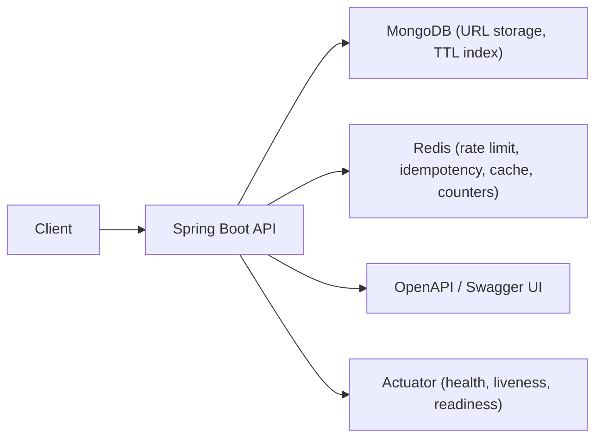

# URL Shortener Service - Production-Style Backend

Production-oriented URL shortener built with Spring Boot.
The service focuses on practical reliability concerns: idempotent create operations, abuse protection, cache-backed redirects, click analytics, and integration-level verification against real infrastructure.

## Highlights

- Single-service production architecture (Spring Boot + MongoDB + Redis)
- Safe retries on `POST /shorten-url` via optional `Idempotency-Key`
- Redis token bucket rate limiting to protect create-link endpoint
- Redirect cache in Redis (cache-aside) to offload MongoDB on hot links
- Atomic click counters in Redis (`INCR`) with TTL aligned to link expiration
- MongoDB TTL-based data lifecycle for automatic expired link cleanup
- Actuator health/liveness/readiness endpoints for operational visibility
- OpenAPI + Swagger UI for contract discoverability and testing
- Integration-test-first verification with Testcontainers (MongoDB + Redis)

## Architecture



### How it works (high level)

- Client sends `POST /shorten-url` with target URL and optional `Idempotency-Key`.
- API applies Redis-based rate limiting before creating a new short link.
- For successful create requests, short-link data is persisted in MongoDB and related Redis keys are initialized.
- Redirect requests `GET /{id}` resolve target URL from Redis cache first, then fallback to MongoDB on cache miss.
- Every successful redirect increments a Redis click counter, exposed via `GET /stats/{id}`.

## Engineering Challenges

- Preventing abusive traffic on create-link endpoint without harming normal clients
- Keeping create operations retry-safe (idempotency replay + conflict detection)
- Balancing redirect performance and correctness with cache-aside strategy
- Preserving consistency between MongoDB TTL expiration and Redis key TTLs
- Validating behavior with real dependencies, not mocked infrastructure

## Tech Stack

- **Backend:** Java 17, Spring Boot 3 (Web, Data MongoDB, Data Redis, Actuator), Maven
- **Data:** MongoDB, Redis
- **API Docs:** springdoc OpenAPI, Swagger UI
- **Testing:** Spring Boot Test, Testcontainers (MongoDB, Redis)
- **Infra/Runtime:** Docker, Docker Compose

## Quick Start

### Prerequisites

- Java 17+
- Maven 3.9+
- Docker

### Run dependencies

```bash
cd docker
docker compose up -d
```

### Run application

```bash
mvn clean install
mvn spring-boot:run
```

By default, API starts on `http://localhost:8080`.

## How to Verify

```bash
# run integration tests
mvn test
```

Then verify key endpoints:

- Swagger UI: `http://localhost:8080/swagger-ui.html`
- OpenAPI JSON: `http://localhost:8080/v3/api-docs`
- Health: `http://localhost:8080/actuator/health`
- Liveness: `http://localhost:8080/actuator/health/liveness`
- Readiness: `http://localhost:8080/actuator/health/readiness`

## Key Endpoints

Representative public endpoints:

- `POST /shorten-url` - create short URL (supports optional `Idempotency-Key`)
- `GET /{id}` - redirect by short ID (`302 Found` + `Location` header)
- `GET /stats/{id}` - get click count for short ID

## Why This Project

This project demonstrates production-style backend thinking in a compact service:

- reliability patterns (idempotency, rate limiting)
- performance patterns (cache-aside redirects)
- operational readiness (Actuator probes, OpenAPI contract)
- integration-level verification against real DB/cache

It is intentionally designed as an interview-ready backend artifact to discuss trade-offs between reliability, performance, and correctness.

## Project Structure

- `src/main/java/com/url_shortener/` - controllers, services, repositories, domain logic
- `src/main/resources/` - runtime configuration (`application.yml`)
- `src/test/java/com/url_shortener/` - integration tests (`UrlControllerIT`)
- `docker/` - local MongoDB compose setup

## Author

Dumitru Diacenco, Java Backend Engineer
